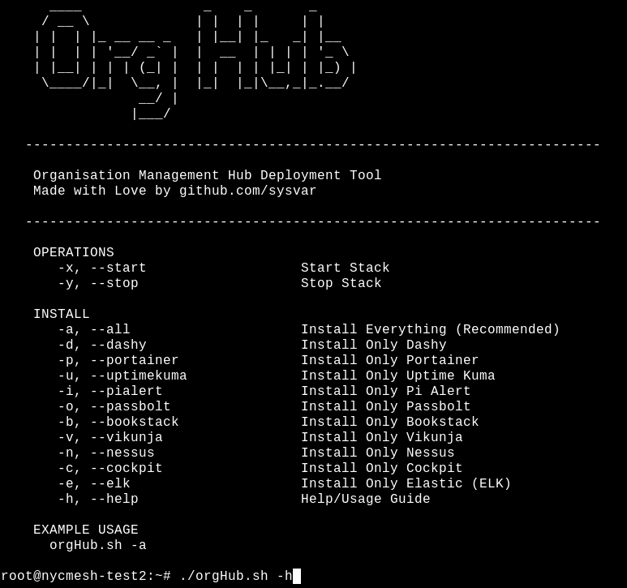
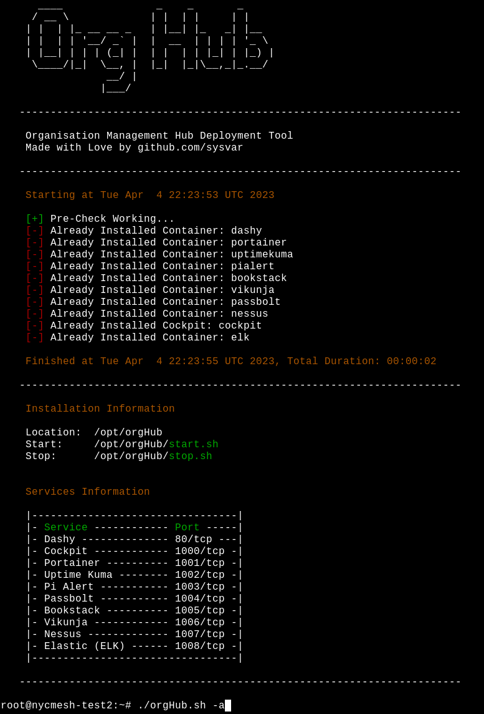

# orgHub
Dockerised base template software for a new organisation, a quick way to get started. 

## Features
 - Dashboard Links (Dashy - https://github.com/Lissy93/dashy)
 - Docker Container Management (Portainer - https://www.portainer.io)
 - Service Uptime Monitoring (Uptime Kuma - https://github.com/louislam/uptime-kuma) 
 - New LAN Device Monitoring (Pi.Alert - https://github.com/pucherot/Pi.Alert)
 - Password Management (Passbolt - https://www.passbolt.com)
 - Documentation (Bookstack - https://www.bookstackapp.com)
 - Organise, Kanban, Gantt (Vikunja - https://vikunja.io)
 - Vulnerability Scanner (Nessus - https://www.tenable.com/products/nessus)
 - Device Metrics and Management (Cockpit - https://cockpit-project.org)
 - SIEM Event Collection and Security (Elastic - https://www.elastic.co/what-is/elk-stack)

## Requirements
 - Debian Flavor of Linux
 - At least 4GB RAM, 4 CPU Cores, 10GB Disk
 - Script will satisfy all software requriments

## Install
`su -l`

`wget https://raw.githubusercontent.com/sysvar/orgHub/main/orgHub.sh && chmod +x orgHub.sh && ./orgHub.sh -h`

## Example

## Considerations
 - Change default login credentials
 - Only expose the services you need exposing
 - Elastic in current state should not be public internet facing, reduce port exposure

## Exposure
See graphic above.

**Elastic requires additional setup to swtich from 5061/tcp to 1008/tcp** - Current Elastic Ports:
 - 5044: Logstash Beats input
 - 50000: Logstash TCP input
 - 9600: Logstash monitoring API
 - 9200: Elasticsearch HTTP
 - 9300: Elasticsearch TCP transport
 - 5601: Kibana

## Default Logins
 - Dashy       = `manage/manageIT3!`
 - Portainer   = < VISIT WEBPAGE >
 - Uptime Kuma = < VISIT WEBPAGE > 
 - Pi.Alert    = < ADDITIONAL SETUP REQUIRED - See configs created on first run >
 - Passbolt    = < ADDITIONAL SETUP REQUIRED - 1. Start Container, 2. Go to container folder, 3. run `./finish_setup.sh`, 4. Visit Webpage >
 - Bookstack   = `admin@admin.com/password`
 - Vikunja     = < VISIT WEBPAGE >
 - Nessus      = `manage/manageIT3!`
 - Cockpit     = < UNIX DEVICE LOGINS >
 - Elastic     = `elastic/changeme`

## Future Dev
 - Maybe a finsih_setup.sh for Elastic so it changes ports and stops exposing some services.
